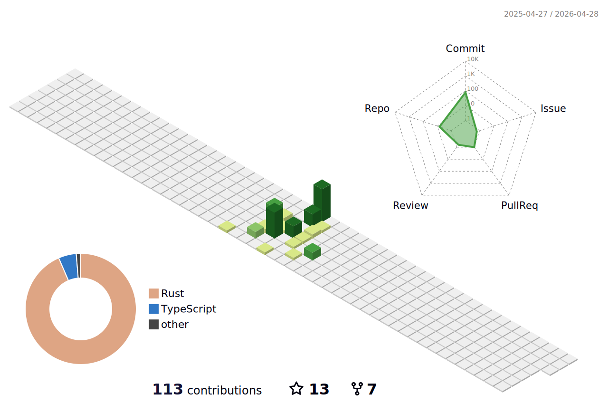

<h1 align="center">Hey there!👋, I'm Deepanshu Tyagi</h1>
<h3 align="center">A passionate Full Stack developer from India</h3>

  

- 🌱 I’m currently learning about **Kubernetes**

- 💬 Ask me about **Django and Flask**

- 📫 How to reach me **29deepanshutyagi@gmail.com**

# 💻 Languages and Tools

 
  
  
  
  
  
  
  
  
  
  
  
  
  
  
    

# 📊 GitHub Stats:

  <a href="https://github.com/29deepanshutyagi">
     
    

    
&nbsp;

    

  </a>

### ✍️ Just a random dev quote:

---

## 🌐 Socials

