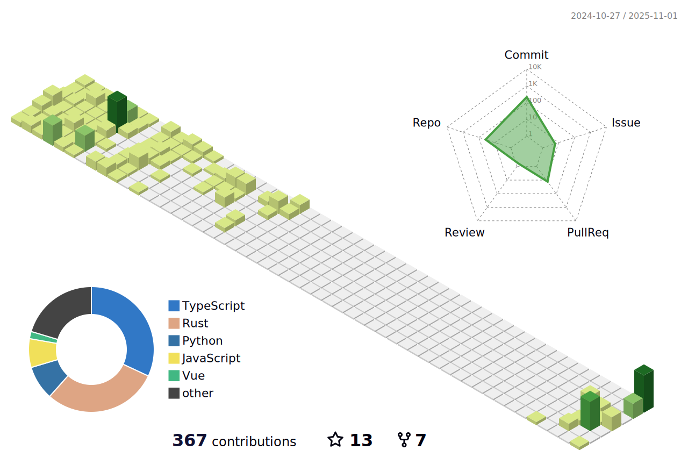

<h1 align="center">Hey there! 👋, I'm Deepanshu Tyagi</h1>
<h3 align="center">A passionate Full Stack developer from India</h3>

  

  

- 🌱 I’m currently learning about **Kubernetes**  
- 💬 Ask me about **Django and Flask**  
- 📫 How to reach me: **29deepanshutyagi@gmail.com**  

---

## 💻 Languages and Tools:

  
  
  
  
  
  
  
  
  
  
  
  
  

---

## 📊 GitHub Stats:

  

  

  

  

  

  

---

## 🌐 Socials:

  
  
  

---

### ✍️ Just a Random Dev Quote:

  

